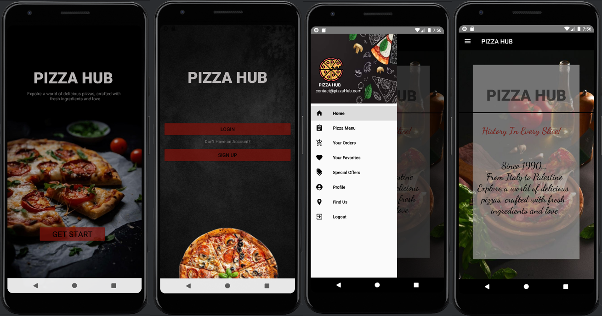
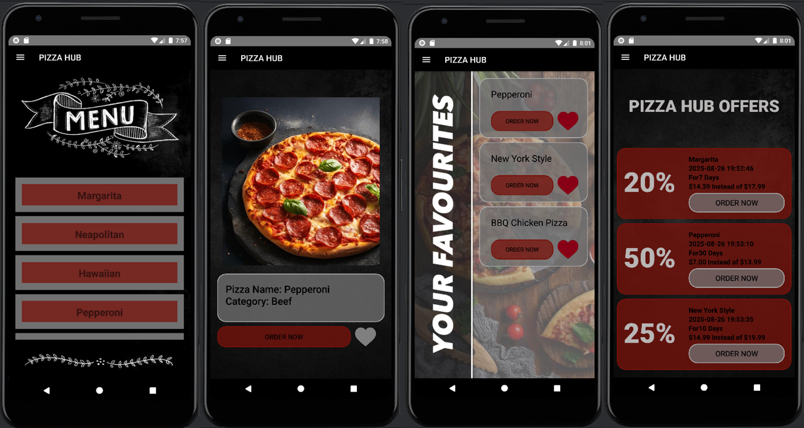

# 🍕 Advance Pizza – Android Ordering App

## 📖 Project Overview
**Advance Pizza** is an Android application built for a pizza restaurant to allow customers to order pizzas online and manage their accounts. The app is designed to be **user-friendly** and provides both **customer** and **admin** roles with distinct features.  

The application uses:
- **SQLite database** for storing user and order data.  
- **REST API** for fetching pizza types.  
- **Fragments & Navigation Drawer** for structured navigation.  
- **SharedPreferences** for storing user preferences.  
- **Animations & Notifications** for a smooth experience.  

---

## 🚀 Features

### 🔹 1. Introduction Layout
- Displays a **Get Started** button.  
- Connects to REST API (`https://18fbea62d74a40eab49f72e12163fe6c.api.mockbin.io/`) to fetch pizza types.  
- Handles both **success** (redirect to login/registration) and **error** (show error message).  

---

### 🔹 2. Authentication
- **Login Page**
  - Login using **email + password** stored in DB.  
  - Includes **“Remember Me”** checkbox (saves email in SharedPreferences).  

- **Registration Page**
  - Fields: Email, Phone (10 digits, starts with `05`), First/Last name, Gender (spinner), Password + Confirm Password.  
  - **Validations**:
    - Email format required.  
    - Phone must be exactly 10 digits.  
    - Names ≥ 3 characters.  
    - Password ≥ 8 chars, must include letters + numbers.  
    - Passwords stored securely using **hash function**.  
  - If validation passes → user registered and redirected to login.  

---

### 🔹 3. Customer Home (Navigation Drawer)
- **Home** → restaurant history.  
- **Pizza Menu**
  - Displays pizza types in a list (from REST API).  
  - Supports **filtering/search** (Price, Size, Category).  
  - Each pizza has:  
    - ➕ Add to Favorites  
    - 🛒 Order (with size, price, quantity, submit).  
- **Your Orders** → shows order history with date/time.  
- **Favorites** → shows saved pizzas + re-order option + undo favorite.  
- **Special Offers** → order special offers like normal pizzas.  
- **Profile** → view/edit personal details (validations applied).  
- **Call us / Find us**
  - 📞 Call: `0599000000`  
  - 📍 Google Maps: `(31.961013, 35.190483)`  
  - 📧 Send email: `AdvancePizza@Pizza.com`  
- **Logout** → return to login.  

---

### 🔹 4. Admin Home (Navigation Drawer)
- **Admin Profile** → view/edit personal info.  
- **Add Admin** → register new admins (same validations as Sign-Up).  
- **View All Orders** → list all orders + customer names.  
- **Add Special Offers** → specify pizza type, size, offer period, and total price.  
- **Logout** → return to login.  
- ⚡ Note: one admin is preloaded manually into DB.  

---

### 🔹 5. Extra Features
- Customer profile picture → upload & change.  
- Admin analytics:  
  - Number of orders per pizza type.  
  - Total income per type + overall income.  

---

## 🛠️ Tech Stack
- **Language**: Java (Android SDK)  
- **Database**: SQLite  
- **REST Client**: HttpURLConnection / Retrofit (based on implementation)  
- **UI**: Navigation Drawer, Fragments, Animations (Frame/Tween), Toast notifications  
- **Storage**: SharedPreferences
  
---

## 📱 App Interfaces

Here are some screenshots of the app in action:

